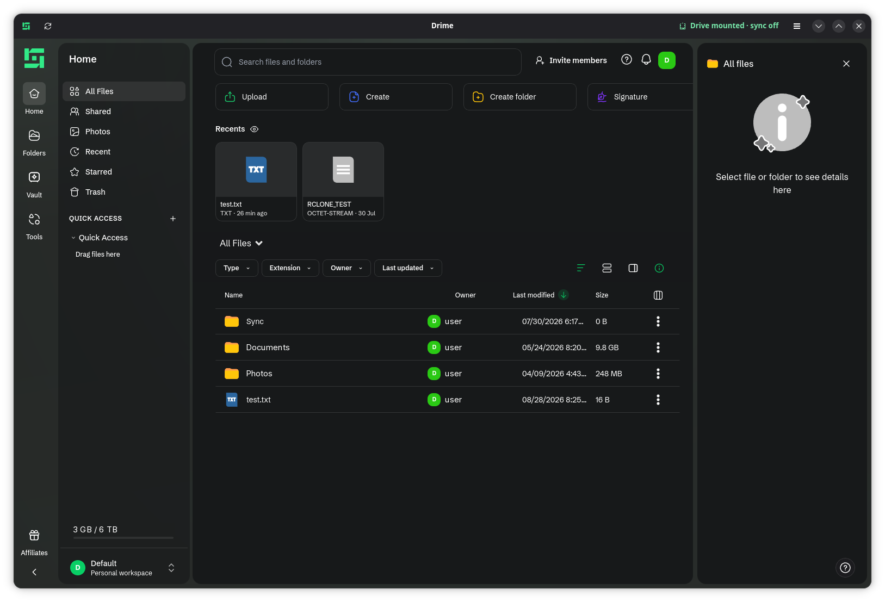
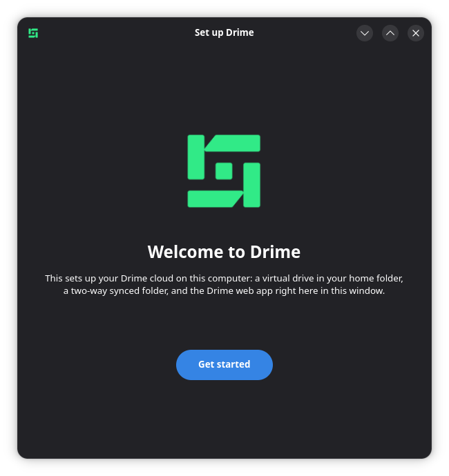
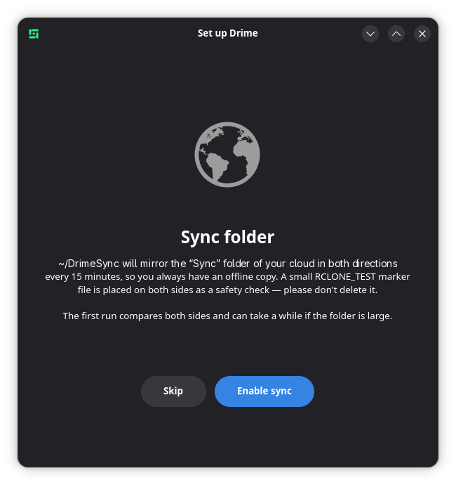
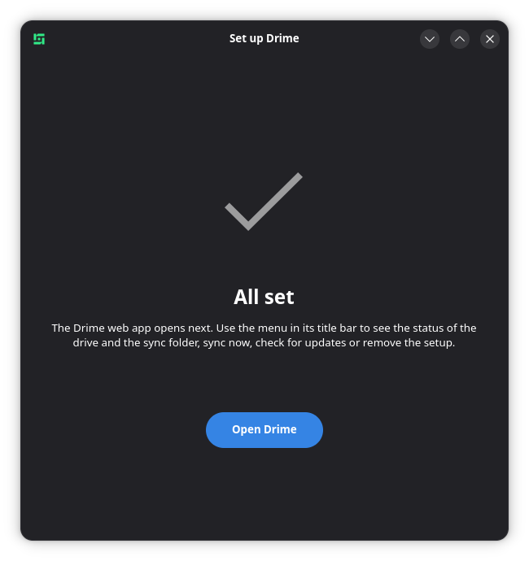

# Drime Desktop for Linux (unofficial)

[Drime](https://drime.cloud) only ships its desktop app for Windows and macOS. This project recreates the desktop experience on Fedora Linux using [rclone's native Drime backend](https://rclone.org/drime/) — an integration [officially announced by Drime](https://drime.cloud/blog-posts/drime-now-supports-native-rclone-integration) — plus a single GNOME app that shows the Drime web app, sets everything up and keeps it running. One RPM, one icon, no browser or Flatpak to install. No reverse engineering, no Wine: just supported APIs.

<p align="center"></p>

## What you get

| Component | What it is | Official-app equivalent |
|---|---|---|
| `~/Drime` | Virtual drive: your whole account mounted on demand with local caching (`rclone mount`, VFS full cache), auto-mounted at login, visible in your file manager's sidebar | The virtual "Drime drive" |
| `~/DrimeSync` | Two-way synced folder mirroring the `Sync` folder of your cloud about every 15 minutes (`rclone bisync` + systemd timer) | Dropbox-style sync folder |
| **Drime** app | One window: the Drime web app (app.drime.cloud, embedded with WebKitGTK) plus status pill and Settings — see [The Drime window](#the-drime-window) | The app's UI + tray menu |
| `pydrime` (optional) | Third-party CLI for scripted uploads/downloads | — |

## Requirements

- **Fedora Workstation** (developed on Fedora 44 / GNOME). Other systemd + GTK4 distributions can use the [git checkout](#advanced-install-from-a-git-checkout) path.
- A Drime account and an **API token**: app.drime.cloud → **Settings → Developer → create token**
- Everything else (`rclone ≥ 1.73`, `fuse3`, `python3-gobject`, GTK4/libadwaita, WebKitGTK) is a regular Fedora package pulled in automatically when you install the RPM. Recommended (pulled in by default): `gnome-software` for one-click updates and `python3-rpm` for exact version comparison.

## Install

1. Download the latest `drime-desktop-<version>.noarch.rpm` from the [Releases page](https://github.com/DaveTheGameDev/drime-desktop-fedora/releases).
2. Double-click it — GNOME Software opens and installs it (or run `sudo dnf install ./drime-desktop-*.rpm`).
3. Open **Drime** from your applications. The wizard asks for your API token and turns on the drive and the sync folder. That's it.

The token goes straight into `~/.config/rclone/rclone.conf` and nowhere else.

## The Drime window

<p align="center">  </p>

After the first-run wizard, opening **Drime** gives you one window:

- **The web app** fills it: sign in once and you stay signed in (the login is stored under `~/.local/share/drime-desktop`, private to this app). Share links, previews, trash, settings, comments — everything the website does. Files you download land in your Downloads folder (a toast offers to open them); uploads work as on the website, and you can drag files from Files (Nautilus) onto the window to upload them into the folder you are viewing (folders can't be dropped — copy those into `~/Drime` instead). Links that would open a new tab open in your normal browser. The window can stay open for days: the app keeps your Drime session alive and renews its security token, so you don't get "CSRF token mismatch" errors after leaving it idle.
- **The status pill** in the title bar — e.g. *Drive mounted · synced 3 min ago* — is green when all is well and turns orange if the drive is down or the last sync failed. Click it to open Settings. If app.drime.cloud can't be reached, the window shows an offline notice with a *Retry* button.
- **The menu (☰)**: *Open Drime folder*, *Open Sync folder*, *Sync now*, *Open in browser*, *Settings*, *About Drime Desktop*.
- **Settings** (Ctrl+,): switch the virtual drive and the sync folder on/off, see the sync log, check for updates, remove the setup.

The drive and the sync folder run in the background as systemd user services — closing the window doesn't stop them; you only need the window for the web app or to check on things. Shortcuts: Ctrl+R/F5 reload, Ctrl+S sync now, Ctrl+/− zoom (Ctrl+0 resets), Ctrl+Q quit.

The embedded view blocks third-party cookies; if a single-sign-on login fails inside the app, use *Open in browser* for that step.

## Updating

- **Drime Desktop itself**: the app checks GitHub Releases a few seconds after it opens and asks you when a newer version exists (*Download and install*, *Later* or *Skip this version*). You can also check by hand: **Drime → ☰ → Settings → Updates → Check for updates**. If a newer release exists, *Download and install* fetches the RPM to your Downloads folder and opens it in GNOME Software (or your default package handler), where you confirm the update. You can keep Drime open while installing: once the new version is on disk the running window notices within ~10 s and offers to restart.
- **rclone and WebKitGTK** (the web engine) update with your normal system updates.

Updates replace the systemd units under `/usr/lib/systemd/user/`; the running mount is not interrupted, new unit settings apply at the next login (or `systemctl --user daemon-reload && systemctl --user restart rclone-drime-mount`).

## Everyday use

- Work in `~/Drime` for anything in your account — saves upload automatically (files are cached locally up to 10 GB, so recently used files open instantly).
- Drop things in `~/DrimeSync` for an always-mirrored offline copy of the cloud's `Sync` folder.
- **Do not delete `~/DrimeSync/RCLONE_TEST`** — it's a safety marker; sync aborts rather than mass-deleting if either side ever looks wrong.
- For sharing, trash, account settings and to check on the drive and sync, open the **Drime** window (see [above](#the-drime-window)).

Terminal equivalents:

```bash
drime-desktop --status                       # same info as the app
systemctl --user status rclone-drime-mount   # mount health
systemctl --user start drime-bisync          # sync right now
journalctl --user -u drime-bisync -e         # sync logs
drime-desktop --help                         # --install, --uninstall, --check-update, --version
```

## Uninstall

1. **Drime → ☰ → Settings → Remove my setup → Remove…** (or `drime-desktop --uninstall`; add `--purge-config` or tick the checkbox to also delete the API token and uninstall pydrime). This unmounts the drive, disables the timer and removes the bookmark, caches, sync state and the web app's login data.
2. Uninstall the *Drime* package in GNOME Software, or `sudo dnf remove drime-desktop`.

What is **kept**: `~/DrimeSync` and everything in your cloud account — always; the window-size file `~/.config/drime-desktop/window.json`; plus your API token (rclone remote), pydrime and its config unless you chose to delete them.

## Caveats

- **Drime's API stores no modification times or hashes**, so the sync folder detects changes by file size only. An edit that keeps a file's exact byte size won't be picked up by `~/DrimeSync`. This is rare, but for important work prefer `~/Drime` — the mount always uploads what you save.
- Tune cache size/behavior with `systemctl --user edit rclone-drime-mount` (override `ExecStart`, e.g. `--vfs-cache-max-size`, `--dir-cache-time`; overrides survive updates, edits to the packaged unit don't). Changes made in the cloud can take up to a minute to appear in `~/Drime`.
- Drime's own desktop apps are beta; the rclone backend is young too. Keep backups of anything irreplaceable.
- The GNOME Files **sidebar** bookmark keeps the generic folder glyph: Nautilus hardcodes bookmark icons, so only the folder in the main view and the app launchers show the Drime logo.
- The Drime logo (`assets/drime.png`) belongs to Drime and is used only to identify the service; it is not covered by this project's MIT license.

## Advanced: install from a git checkout

To hack on it without the RPM, or on other distributions:

```bash
sudo dnf install python3-gobject gtk4 libadwaita webkitgtk6.0 rclone fuse3   # or your distro's equivalents
git clone https://github.com/DaveTheGameDev/drime-desktop-fedora.git
cd drime-desktop-fedora
./install.sh                 # terminal wizard; add --with-pydrime for the CLI
PYTHONPATH=src DRIME_DESKTOP_SRC=$PWD python3 -m drime_desktop.cli    # the GUI, from the checkout
```

`install.sh` checks the packages with `rpm -q` on RPM-based systems and skips that check elsewhere; the setup itself only needs a systemd user session, `rclone` and `fusermount3`. The wizard steps can each be skipped and re-run later from Settings.

In this mode the systemd units are copied to `~/.config/systemd/user/`. If you later install the RPM, the app switches to the packaged units automatically. `./uninstall.sh [--purge-config]` reverses the setup.

<details>
<summary>What the setup does, step by step</summary>

1. `rclone config create drime drime access_token=<TOKEN>` and `rclone about drime:` to verify it
2. `systemctl --user enable --now rclone-drime-mount.service` (units from `/usr/lib/systemd/user/` or `systemd/`)
3. Add `~/Drime` to `~/.config/gtk-3.0/bookmarks`; `gio set ~/Drime metadata::custom-icon file:///usr/share/icons/hicolor/512x512/apps/drime-desktop.png`
4. `mkdir ~/DrimeSync && touch ~/DrimeSync/RCLONE_TEST && rclone copy ~/DrimeSync/RCLONE_TEST drime:Sync/`
5. `rclone bisync ~/DrimeSync drime:Sync --size-only --create-empty-src-dirs --check-access --resync` (the timer runs the same command with `--resilient --recover` instead of `--resync`)
6. `systemctl --user enable --now drime-bisync.timer`

The launcher (`io.github.davethegamedev.DrimeDesktop.desktop`) and the icon are installed system-wide by the package. The web app's cache lives in `~/.cache/drime-desktop`.
</details>

## Building the RPM

```bash
sudo dnf install rpm-build rpmdevtools rpmlint python3-devel systemd-rpm-macros desktop-file-utils libappstream-glib
make rpm lint            # -> build/RPMS/noarch/drime-desktop-<version>-1.fcNN.noarch.rpm
make install-local       # sudo dnf install it
```

(`make rpm RPMBUILD_OPTS=--nodeps` builds without `python3-devel`.)

**Releasing**: bump `Version:` and `%changelog` in `drime-desktop.spec`, commit, then `git tag v<version> && git push --tags`. The [GitHub Actions workflow](.github/workflows/release.yml) builds the RPM in a Fedora container, lints it and attaches the `.rpm`, `.src.rpm` and source tarball to a GitHub Release. The tag must match the spec version. The release notes are generated by `scripts/release-notes.sh`: the download-guidance header (`.github/release-header.md`) plus that version's `%changelog` entry — so write the changelog for users. (`make release` publishes the same thing by hand if the workflow isn't available.) The app's *Check for updates* reads the latest release through the public GitHub API.

## Repo layout

```
drime-desktop.spec          # RPM spec (single source of the version)
Makefile                    # make rpm / lint / install-local
src/drime_desktop/          # Python package: backend (rclone/systemd), GTK app, embedded web view, wizard, updates, CLI
bin/drime-desktop           # launcher
systemd/                    # user units: mount service, bisync service + timer
desktop/                    # io.github.davethegamedev.DrimeDesktop.desktop (launcher)
assets/                     # icon, AppStream metainfo
install.sh / uninstall.sh   # thin wrappers for git-checkout installs
.github/workflows/          # release build
```

## Contributing

Issues and pull requests are welcome. Bug reports are most useful with the output of `drime-desktop --status`, `journalctl --user -u rclone-drime-mount -u drime-bisync -n 50`, and your Fedora version. Licensed under the [MIT License](LICENSE).

---

*Unofficial project, not affiliated with Drime. Built on [rclone](https://rclone.org/drime/) and [pydrime](https://pydrime.readthedocs.io/).*
